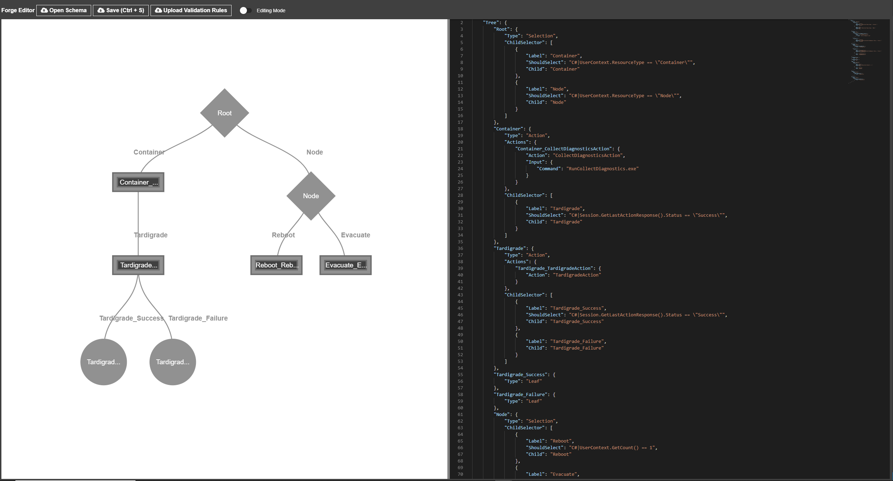

[](https://dev.azure.com/ForgePipeline/Forge/_build/latest?definitionId=1&branchName=master)
		
[Microsoft.Forge.TreeWalker NuGet link](https://www.nuget.org/packages/Microsoft.Forge.TreeWalker/)

## What is Forge?
Forge is a workflow driver solution utilizing a config-based decision tree framework.

At a high level, Forge walks a tree and executes Actions. Output from the Actions get cached/persisted and can be used as input for future Actions, during child selection, etc.. *(think of Microsoft Flow if you are familiar with that, except as a library)*
		
Additionally, Forge accepts a hook into your application that can be called in a similar manner while walking a tree. This allows you to craft rich, dynamic trees based on input, past Action output, and state from your application.

## Forge components at a high-level
Forge has 3 major components: ForgeTree, TreeWalker, and ForgeEditor.
* **ForgeTree** is the JSON schema data contract that defines the tree structure. It contains normal tree-concept objects such as TreeNodes and ChildSelectors, as well as TreeActions and RetryPolicies.

```json
"Container": {
    "Actions": {
        "Container_CollectDiagnosticsAction": {
            "Action": "CollectDiagnosticsAction",
            "Input": {
                "Command": "C#|UserContext.GetCommand()"
            }
        }
    },
    "ChildSelector": [
        {
            "ShouldSelect": "C#|Session.GetLastActionResponse().Status == \"Success\"",
            "Child": "Tardigrade"
        }
    ]
}
```

* **TreeWalker** takes in the ForgeTree and other parameters, and walks the tree to completion. It calls user-defined callbacks and actions, passing in properties from the ForgeTree and the dynamic UserContext object. The TreeWalker makes decisions at run-time about the path it walks by utilizing Roslyn to evaluate C# code-snippets from the ForgeTree.

* **ForgeEditor** is coming to GitHub soon (currently only available internally to Microsoft). ForgeEditor is an Electron application that allows you to visualize and edit the ForgeTree in a clean UI experience. It contains features such as: tree visualization, buttons to create/delete TreeNodes, auto-complete when editing JSON file, text highlighting when hovering over TreeNode, evaluates ForgeSchemaValidationRules while editing, Diagnose mode, etc..



## Advantages of using Forge:
* ***Clarity***: Allows users to intuitively walk a visualized tree and understand the workflow logic.
* ***Versatility***: Once you understand the tree, you can easily add/update nodes, actions, child selectors, paths, etc.. The dynamic capabilities allows for high extensibility on top of the base features.
* ***Velocity***: Updating and deploying ForgeTree schema files is much quicker/easier than deploying code. Allows for hot-pushing updates while your application is running. New behaviors that would take weeks to add to legacy codebases turns into minutes/hours with Forge.
* ***Debuggability***: Add logging to the built-in callbacks before and after visiting each node and inside Actions. This allows users to view statistics on their historical data. Statistics can also be viewed in ForgeEditor as a heatmap to highlight "hot" nodes/paths.
* ***Safety***: It can be easy to typo an Action name or other property in the ForgeTree since they are JSON strings. To help with that, Forge includes the ForgeSchemaValidationRules.json file containing JSON schema rules for ForgeTrees. These rules can be augmented to contain application-specific properties/values, such as enforcing a set of known ForgeActions and ActionInputs. These rules are used in ForgeEditor to help auto-complete properties and highlight typos.
* ***Stateful (optional)***: The IForgeDictionary is used to cache state while Forge walks the tree. This can be implemented by the application to be stateful if desired, but a Dictionary implementation is built-in. This allows applications to pick up where they left off after a failover.

## Is Forge right for my application?
Does your application:
* Make decisions?
* Update frequently?
* Have many contributors?
* Have a rich set of distinct behaviors/actions?
* Have a rich API surface that could be called in various sequences?

If you answered "yes" to any of these questions, then Forge is a great library for you!

## User Story: Azure-Compute Repair Manager
Microsoft Azure-Compute's repair manager service is backed by Forge. Fault information is passed to the TreeWalker and a ForgeTree schema is walked. Depending on the type of fault and a handful of other checks, TreeWalker may attempt in-place recovery actions. If these actions were unsuccessful in mitigating the issue, diagnostics are collected and Tardigrade may be performed. You can read more about Azure’s recovery workflow in this blogpost: https://azure.microsoft.com/en-us/blog/improving-azure-virtual-machines-resiliency-with-project-tardigrade/

*"The biggest (and unexpected) benefit of using Forge has been the democratization of contributors and the velocity of pushing updates. It used to take weeks to implement new features on the old service, and very few engineers had the expertise to make such changes. Since moving our repair workflows to Forge, new features/behaviors/paths are often added by teams that request them. This is possible because of the clarity that visualizing the tree brings. After initial ramp-up time, new contributors are then able to send code reviews out for changes within a day. They also basically become experts themselves and help onboard their teammates. It's magical! A cross-team ecosystem has been organically created and folks are eager to contribute."*

## Further Reading
Check out the [Wiki](https://github.com/microsoft/Forge/wiki) pages for a deeper dive into Forge, as well as How-To guides!

## Contributing
Interested in contributing to Forge? Check out the [Contributing](CONTRIBUTING.md) page for details.

## License
Copyright (c) Microsoft Corporation. All rights reserved.

Licensed under the [MIT](LICENSE.txt) license.
